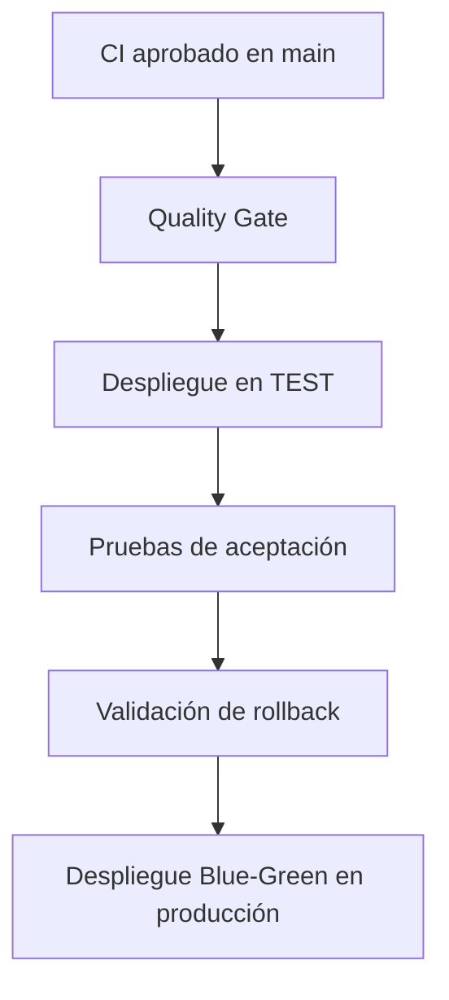

# Examen Final de Automatización de Pruebas
[](https://github.com/DavidSZagal/examen-final-automatizacion/actions/workflows/ci.yml)
[](https://github.com/DavidSZagal/examen-final-automatizacion/actions/workflows/cd-blue-green.yml)

## Descripción

Proyecto académico desarrollado para demostrar la aplicación de automatización de pruebas, integración continua y despliegue continuo.

La solución corresponde a una API REST construida con Java, Spring Boot y Maven. El proyecto incorporará pruebas unitarias, pruebas de integración, pruebas de aceptación, un pipeline de CI y una estrategia de despliegue Blue-Green con rollback.

## Tecnologías utilizadas

- Java 17
- Spring Boot 4.1.1
- Maven
- JUnit
- Mockito
- Maven Surefire
- Maven Failsafe
- JaCoCo
- Git y GitHub

## Estrategia de ramas

El repositorio utiliza un flujo GitFlow simplificado:

- `main`: contiene las versiones estables del proyecto.
- `develop`: integra los cambios antes de publicarlos en `main`.
- `feature/*`: contiene el desarrollo de cada nueva funcionalidad o actividad.

Los cambios pasan desde una rama `feature` hacia `develop` y posteriormente desde `develop` hacia `main` mediante pull requests.

## Configuración de pruebas

- Maven Surefire ejecuta las pruebas unitarias.
- Maven Failsafe ejecuta las pruebas de integración.
- JaCoCo genera el reporte de cobertura del código.

## Ejecución local

- Pruebas unitarias: `mvn clean test`
- Verificación completa: `mvn clean verify`
- Verificación en Windows: `mvn.cmd clean verify`
- Reporte de cobertura: `target/site/jacoco/index.html`

## Autor

David Sandoval
## Actividad 2: Integración continua y pruebas automatizadas

### Funcionalidad implementada

Se desarrolló una API REST para administrar productos. La aplicación permite registrar productos, consultar el catálogo y reducir el stock disponible. Los datos se almacenan mediante Spring Data JPA y una base de datos H2.

### Endpoints disponibles

| Método | Endpoint | Descripción |
| --- | --- | --- |
| GET | `/api/productos` | Obtiene todos los productos registrados. |
| POST | `/api/productos` | Registra un producto validando nombre, precio y stock. |
| PATCH | `/api/productos/{id}/stock?cantidad=2` | Reduce el stock de un producto existente. |

### Estrategia de pruebas

El proyecto contiene los siguientes niveles de prueba:

- **Pruebas unitarias:** `ProductoServiceTest` utiliza JUnit y Mockito para comprobar la creación de productos, duplicados, reducción de stock y stock insuficiente.
- **Pruebas de integración:** `ProductoControllerIT` utiliza Spring Boot, MockMvc y H2 para comprobar los endpoints y su integración con la base de datos.
- **Prueba de contexto:** verifica que la aplicación Spring Boot pueda iniciar correctamente.

Actualmente se ejecutan:

- 5 pruebas unitarias y de contexto mediante Maven Surefire.
- 3 pruebas de integración mediante Maven Failsafe.
- 8 pruebas automatizadas en total.
- 0 fallos y 0 errores.

### Pipeline de integración continua

El workflow se encuentra en:

```text
.github/workflows/ci.yml
```

El pipeline se ejecuta automáticamente al realizar:

- Push en `main`, `develop` o ramas `feature/**`.
- Pull request hacia `main` o `develop`.
- Ejecución manual mediante `workflow_dispatch`.

El pipeline realiza las siguientes tareas:

1. Descarga el código del repositorio.
2. Configura Java 17 y la caché de Maven.
3. Compila el proyecto.
4. Ejecuta las pruebas unitarias.
5. Ejecuta las pruebas de integración.
6. Genera el reporte de cobertura JaCoCo.
7. Publica los reportes de prueba como artefactos.
8. Publica la aplicación Java compilada.

### Ejecución local

Para ejecutar todas las validaciones en Windows:

```bash
mvn.cmd clean verify
```

Para ejecutar solamente las pruebas unitarias:

```bash
mvn.cmd test
```

Los reportes quedan disponibles en:

```text
target/surefire-reports
target/failsafe-reports
target/site/jacoco/index.html
```
## Actividad 3: Despliegue continuo Blue-Green

### Objetivo

Implementar un pipeline de despliegue continuo que publique la aplicación primero en un ambiente de pruebas, ejecute pruebas de aceptación y posteriormente realice un despliegue Blue-Green en producción con capacidad de rollback automático.

### Flujo de despliegue



El pipeline de despliegue solamente comienza cuando el workflow de integración continua termina correctamente en la rama `main`. También puede ejecutarse manualmente mediante `workflow_dispatch`.

### Ambientes

| Ambiente | Propósito | Validaciones |
| --- | --- | --- |
| `test` | Validar el paquete antes de publicarlo | Health check y pruebas de aceptación |
| `production` | Publicar la versión aprobada | Rollback, health check y cambio de tráfico |

Los ambientes se administran mediante GitHub Environments y se ejecutan en runners aislados de GitHub Actions.

### Pruebas de aceptación

La clase `ProductoAcceptanceTest` inicia la aplicación en un puerto aleatorio y utiliza peticiones HTTP reales para comprobar:

- Registro de un producto.
- Consulta del catálogo.
- Reducción correcta del stock.
- Rechazo de una operación con stock insuficiente.
- Códigos de respuesta HTTP esperados.

Las pruebas de aceptación son ejecutadas mediante Maven Failsafe después del despliegue en el ambiente `test`.

### Estrategia Blue-Green

El script se encuentra en:

```text
scripts/blue-green-deploy.sh
```

La estrategia mantiene dos slots:

- `blue`: versión actualmente activa o versión anterior.
- `green`: nueva versión candidata.

Durante cada despliegue se realizan las siguientes acciones:

1. Identificar el slot actualmente activo.
2. Copiar el paquete al slot inactivo.
3. Iniciar la nueva versión.
4. Consultar `/actuator/health`.
5. Cambiar el tráfico solamente si el estado es `UP`.
6. Mantener el slot anterior disponible para una recuperación inmediata.

En la siguiente ejecución, los roles de `blue` y `green` se intercambian.

### Rollback automático

Si el health check no responde correctamente:

1. El cambio de tráfico es cancelado.
2. El slot anterior permanece activo.
3. La versión defectuosa no es publicada.
4. El evento queda registrado como `status=ROLLBACK`.
5. El pipeline termina con error para impedir una publicación inválida.

El pipeline contiene una simulación controlada de fallo para comprobar automáticamente que el rollback funciona antes del despliegue final.

### Pipeline CD

El workflow se encuentra en:

```text
.github/workflows/cd-blue-green.yml
```

Está compuesto por tres trabajos:

1. `Quality Gate y paquete`.
2. `Desplegar y probar en TEST`.
3. `Desplegar Blue-Green en PRODUCCION`.

El mismo archivo JAR generado por el Quality Gate se transfiere entre los trabajos mediante artefactos de GitHub Actions.

### Ejecución local

Pruebas de aceptación:

```bash
mvn.cmd -Dit.test=ProductoAcceptanceTest verify
```

Despliegue Blue-Green:

```bash
bash scripts/blue-green-deploy.sh target/examen-final-automatizacion-0.0.1-SNAPSHOT.jar target/blue-green-local
```

Validación de rollback:

```bash
FORCE_HEALTHCHECK_FAILURE=true bash scripts/blue-green-deploy.sh target/examen-final-automatizacion-0.0.1-SNAPSHOT.jar target/blue-green-rollback
```

### Artefactos de despliegue

El pipeline conserva durante 30 días:

- Aplicación Java compilada.
- Reportes de pruebas y cobertura.
- Evidencias del ambiente `test`.
- Estado del slot activo.
- Metadatos del despliegue.
- Registro del rollback.
- Evidencias del despliegue en producción.